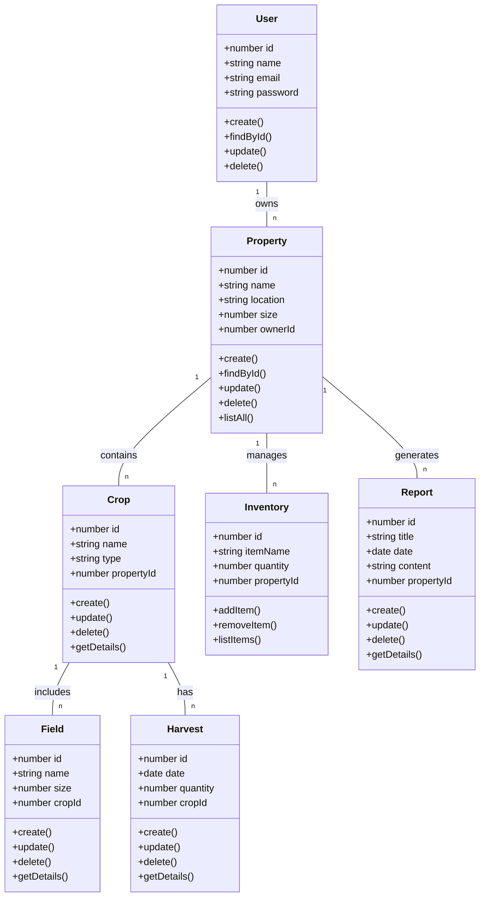

# Bingo - Sistema de Gestão Agrícola e Agropecuária

## Descrição
Bingo é um sistema de gestão voltado para o agronegócio, proporcionando uma plataforma robusta para a administração de propriedades rurais, cultivo e inventário. O objetivo é facilitar a gestão e otimizar os processos envolvidos na produção agrícola, oferecendo funcionalidades completas que atendem às necessidades do campo.

## Funcionalidades
- Cadastro de usuários
- Gerenciamento de propriedades
- Registro de culturas
- Controle de campos
- Monitoramento de colheitas
- Gerenciamento de inventário
- Geração de relatórios

## Diagrama de Classes

## Tecnologias Utilizadas
- Node.js
- Express
- Sequelize
- PostgreSQL
- dotenv
- Mermaid (para diagrama de classes)

## Como Executar o Projeto
1. Clone o repositório
2. Instale as dependências: `npm install`
3. Configure as variáveis de ambiente no arquivo `.env`
4. Execute as migrações: `npx sequelize-cli db:migrate`
5. Inicie o servidor: `npm start`

## Licença
Este projeto está sob a Licença MIT.
